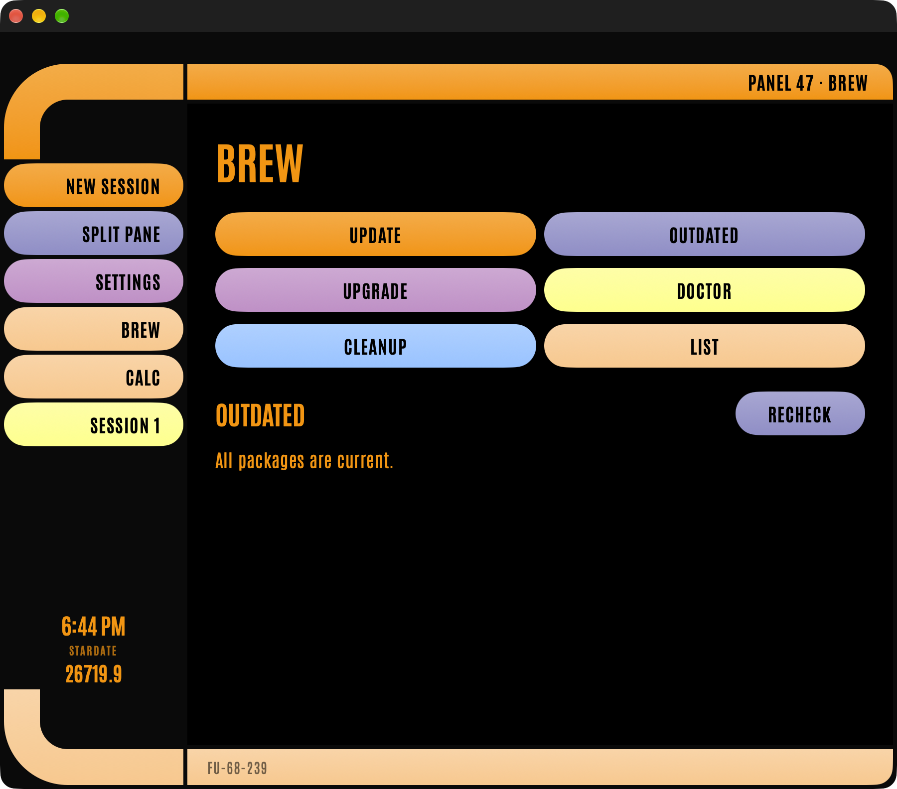
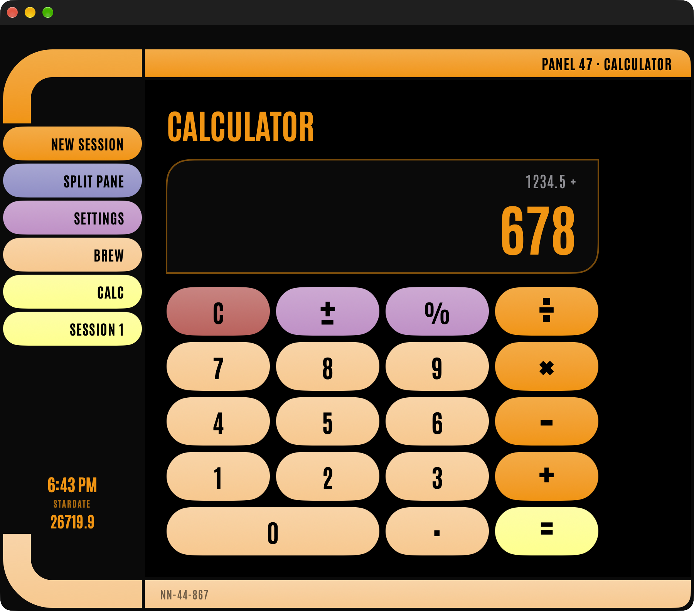

# Panel 47

A macOS terminal with an LCARS-style interface, written in SwiftUI.

Underneath it is a real terminal (your own shell, in real PTY sessions). On top of it, common tasks get their own panels, in the swept-corner, orange-and-lilac style of a starship console, so you don't have to type commands or read raw terminal output for them.

<p>
  
  
</p>

> **Unofficial fan project.** Panel 47 is not affiliated with, endorsed by, or sponsored by Paramount, CBS, or the Star Trek franchise. Star Trek, LCARS and related names and marks belong to their respective owners. This project is non-commercial and uses no Star Trek logos, artwork or audio.

## Features

- **Real terminal sessions.** Built on [SwiftTerm](https://github.com/migueldeicaza/SwiftTerm). Open as many sessions as you like, switch between them from the sidebar, and split the view to show two side by side. Sessions start as login shells, so tools installed via Homebrew (or anything else set up in `~/.zprofile`) are on your `PATH`.
- **Command panels for tools you actually have.** A **BREW** button appears only if Homebrew is detected. Its actions (update, outdated, upgrade, doctor, cleanup, list) run in a separate background process and stream their output into an LCARS-styled view. Your terminal sessions aren't involved.
- **One-tap upgrades.** The BREW panel runs `brew outdated` and shows each outdated package as its own button. Tap one to run `brew upgrade <name>`.
- **Calculator.** An LCARS calculator with exact decimal math (0.1 + 0.2 is 0.3) and keyboard support.
- **Live readouts.** Clock and stardate in the sidebar.
- **Settings.** Font size and terminal color scheme (applied live to open sessions), shell, working directory, and optional UI sounds. Sounds are off by default and are synthesized in code, so there is no sampled audio.

## Requirements

- macOS 27 (the deployment target is 27.0)
- Xcode with the macOS 27 SDK (currently a beta)
- [XcodeGen](https://github.com/yonaskolb/XcodeGen): `brew install xcodegen`

## Building

The Xcode project is generated from `project.yml`, so generate it first:

```sh
xcodegen generate
open Panel47.xcodeproj
```

Or from the command line:

```sh
xcodebuild -project Panel47.xcodeproj -scheme Panel47 -configuration Debug \
  -skipPackagePluginValidation build
```

A few things to know:

- **SwiftTerm's build plugin.** Xcode may ask you to trust it when you first build. From the command line, pass `-skipPackagePluginValidation` as above.
- **Metal Toolchain.** SwiftTerm's renderer needs Xcode's Metal Toolchain component. If the build says it's missing, run `xcodebuild -downloadComponent MetalToolchain`.
- **Signing.** `project.yml` contains the original author's Apple Developer team ID and bundle identifier prefix. Change `DEVELOPMENT_TEAM` and `bundleIdPrefix` to your own (and re-run `xcodegen generate`) before building.

## Tests

```sh
xcodebuild -project Panel47.xcodeproj -scheme Panel47 -configuration Debug \
  -skipPackagePluginValidation -only-testing:Panel47Tests test
```

The unit tests cover the calculator engine, session management, settings persistence, the stardate math, Homebrew detection, output parsing, and the background command runner. The UI test target is only a launch check and needs macOS UI automation permission to run.

## A note on security

The App Sandbox is turned off, because a terminal has to be able to start your shell and everything you run in it. Terminal sessions and command panels run with your user's privileges. The BREW panel only runs a fixed set of commands, plus `brew upgrade <name>` for package names that Homebrew reports and that are checked against a strict character set before they reach a shell.

## Project layout

| Path | What's there |
| --- | --- |
| `Panel47/LCARS/` | The design system (palette, elbow shape, buttons) and every screen: chrome, panels, calculator, settings |
| `Panel47/` | Sessions, settings, tool detection, the background command runner, the calculator engine, stardate |
| `Panel47Tests/` | Unit tests |
| `design/AppIcon.svg` | Source for the app icon |
| `project.yml` | XcodeGen project definition |

Development happens on `dev`; changes are promoted `dev` → `stage` → `main` through pull requests.

## Credits and licenses

- Panel 47's source code is released under the [MIT License](LICENSE).
- [SwiftTerm](https://github.com/migueldeicaza/SwiftTerm) by Miguel de Icaza and contributors (MIT) provides the terminal engine, fetched via Swift Package Manager.
- [Antonio](https://github.com/googlefonts/antonioFont) by The Antonio Project Authors is bundled under the SIL Open Font License 1.1. See [LICENSES-Antonio-OFL.txt](LICENSES-Antonio-OFL.txt).
